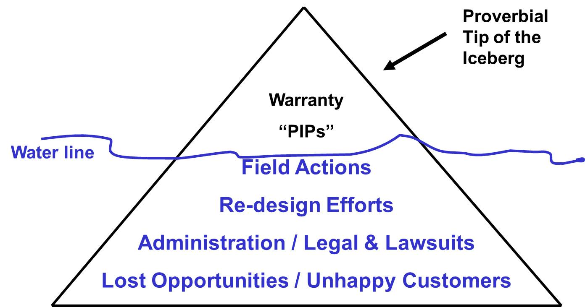
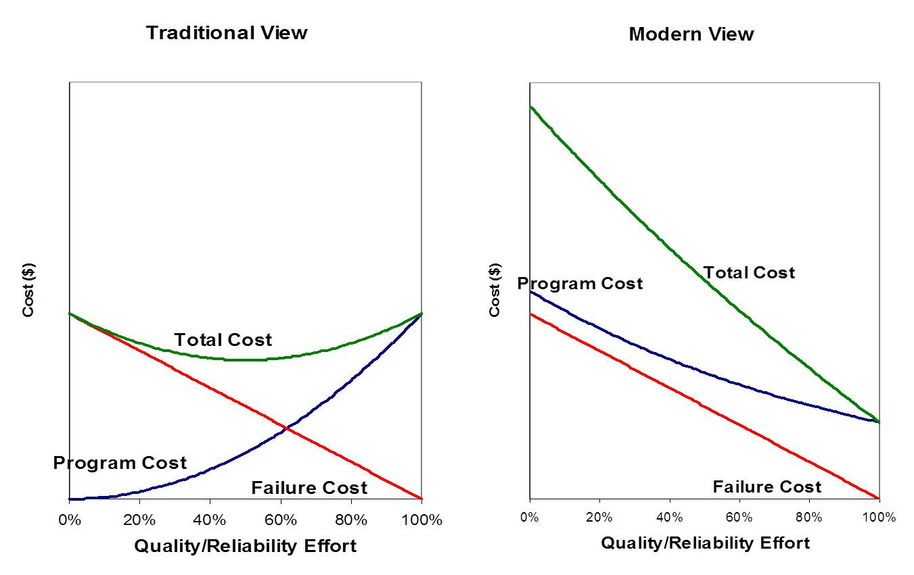
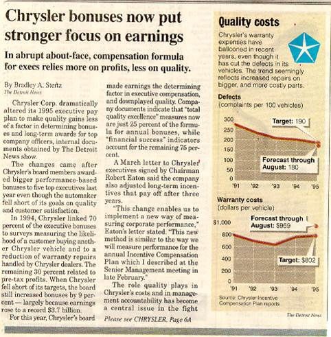

## Benefits of Reliability

- Development time
    + Unanticipated failures are a leading cause of program delays

- Warranty cost
    + Poor reliability leads to excessive warranty costs that reduce company profits

- Market share
    + Reliability is a dominant factor, e.g., Chevy Malibu versus Toyota Camry

The three most obvious benefits of reliability are reduced development time, reduced warranty cost, and increased market share. Reliability has a significant impact on Customer Satisfaction, Recurring Maintenance Costs, Ability to meet Service Objectives, Capital Costs, Ability to Market Products/Services, and Safety. Therefore improving reliability is important to business units because it will help to reduce Testing Cost (by reducing test time required to meet goal), Warranty Cost, After Warranty Maintenance Cost, allowances and recalls. Reliability will also help business units by allowing them to recognize when a product needs special care and what areas on a product are deficient.

## Cost of Unreliability Iceberg

{width=100%}

Analogous to an iceberg where the majority of mass is below the surface of the water, the highest warranty costs are often hidden costs. We often quantify the costs of warranty claims and recalls, but there are many other associated costs that are not readily quantifiable:

- Cost of unassociated claims

- Rework, including:  cost for missing ship dates; factory floor space that must be dedicated to end-of-line repairs; work-in-process inventory; cost of inspection

- Customer support time and expense

- Engineers spend time on current products instead of future products

- Test programs take too long since reference machine is unreliable

- Service Processing can only audit a few claims due to volume of work

- Others?

## Reliability and Life Cycle Costs

{width=100%}

This chart provides two views of reliability and life cycle costs.  The traditional view, by measuring only the "tip of the iceberg" costs (warranty, allowances and recalls), sees program costs increasing as more effort is expended on quality/reliability improvement.  This suggests that the minimum total cost occurs in the middle.  The modern view, by measuring the "below the surface of the water" costs as well as above, sees program costs decreasing as more effort is expended on quality/reliability improvement.  This suggests that the minimum total cost occurs at 100% effort.  

Many people think this means we are proscribing maximum effort on quality/reliability improvement, but that is not the intention of these charts.  They are intended to show that you do not save money by cutting back on quality/reliability.  In fact you're probably adding costs to the program, because you will incur far more warranty costs than the savings from quality/reliability effort reduction.  Maybe this is what got Chrysler in so much trouble?

{width=100%}

Besides providing insight into defects vs. warranty cost per vehicle, this article shows what can happen when a company stops focusing on quality/reliability.  Prior to 1995, "Chrysler linked 70 percent of the executive bonuses to surveys measuring the likelihood of a customer buying another Chrysler vehicle and to a reduction of warranty repairs..."  At that time they were the darling of the automotive industry because they were as profitable as Ford and GM with only a fraction of the assets.  And Ford and GM were busy trying to figure out how Chrysler did that (Chrysler made a profit from its Neon while GM and Ford had to sell their "CAFE" cars at a loss).  Then in 1995, Chrysler changed so that only 25% of the executive bonuses were linked to quality.  And the rest, as they say, is history:  things got so bad that Chrysler is no longer with us. Is this merely a coincidence?  Maybe, maybe not - we'll never know for sure.  But we do know that customers stopped buying/leasing Chrysler products at the price points that made Chrysler so profitable, and they could not increase their prices to remain profitable and maintain market share, and so they stopped being profitable.

## Observations

- The most important numbers are "unknown and unknowable" (Deming)

- Cost/Benefit analyses will never fully capture the costs of unreliability or the benefits of reliability

- Do the right thing, e.g.,
    + Improve the product
    + Delay the program
    + Work on something else
    
A very wise man, W. Edwards Deming, said that the most important numbers are "unknown and unknowable" (Deming was actually quoting another very wise man).  For instance, we never know the costs associated with an angry customer that tells 9-20 other people not a buy a product.  And we never know the marketing costs expended trying to win back that customer and undo the perceptions of the 9-20 other people.  And do we measure the total costs of the discounts offered to move products that customers don't want at the list price?

This lack of knowledge might be OK - after all many companies operating this way have been around for a very long time - but analysts are often asked to do a cost/benefit analysis to make decisions with respect to quality/reliability improvement.  And due to the lack of knowledge of the costs of unreliability and the benefits of reliability, the status quo often comes out on top and nothing changes.

So, what do we do?  We need to believe in the basic quality/reliability principles (remember "quality is free"?) and do the right thing, either add resources to improve the product, delay the program until it's right for the market, or drop it and work on something else that has a better chance of success.
