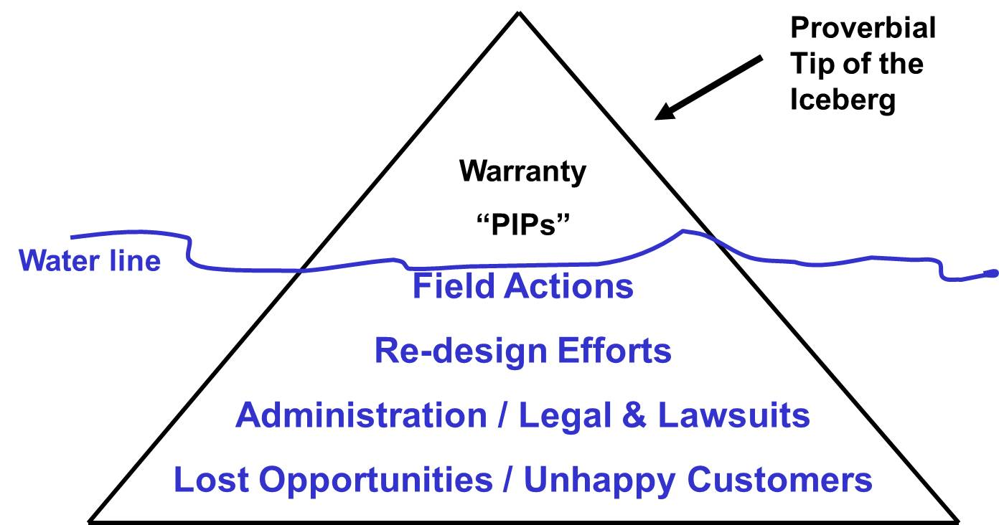
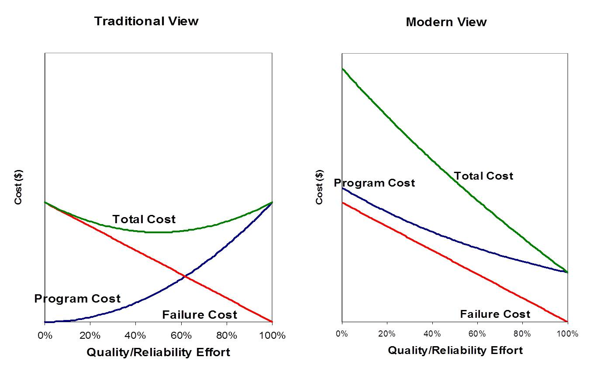
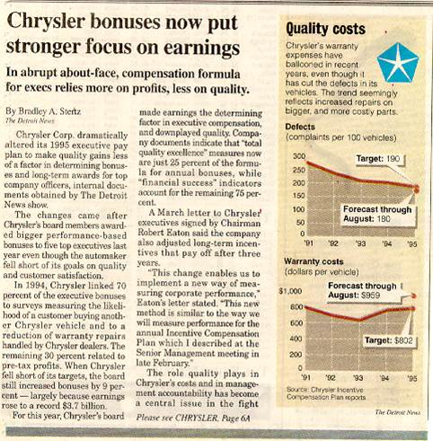

Reliability Overview Excerpt
================
Robert A. Stevens
2021-03-10

## Benefits of Reliability

  - Development time
      - Unanticipated failures are a leading cause of program delays
  - Warranty cost
      - Poor reliability leads to excessive warranty costs that reduce
        company profits
  - Market share
      - Reliability is a dominant factor, e.g., Chevy Malibu versus
        Toyota Camry

The three most obvious benefits of reliability are reduced development
time, reduced warranty cost, and increased market share. Reliability has
a significant impact on Customer Satisfaction, Recurring Maintenance
Costs, Ability to meet Service Objectives, Capital Costs, Ability to
Market Products/Services, and Safety. Therefore improving reliability is
important to business units because it will help to reduce Testing Cost
(by reducing test time required to meet goal), Warranty Cost, After
Warranty Maintenance Cost, allowances and recalls. Reliability will also
help business units by allowing them to recognize when a product needs
special care and what areas on a product are deficient.

## Cost of Unreliability Iceberg

Analogous to an iceberg where the majority of mass is below the surface
of the water, the highest warranty costs are often hidden costs. We
often quantify the costs of warranty claims and recalls, but there are
many other associated costs that are not readily quantifiable:

  - Cost of unassociated claims

  - Rework, including: cost for missing ship dates; factory floor space
    that must be dedicated to end-of-line repairs; work-in-process
    inventory; cost of inspection

  - Customer support time and expense

  - Engineers spend time on current products instead of future products

  - Test programs take too long since reference machine is unreliable

  - Service Processing can only audit a few claims due to volume of work

  - Others?

## Reliability and Life Cycle Costs

This chart provides two views of reliability and life cycle costs. The
traditional view, by measuring only the “tip of the iceberg” costs
(warranty, allowances and recalls), sees program costs increasing as
more effort is expended on quality/reliability improvement. This
suggests that the minimum total cost occurs in the middle. The modern
view, by measuring the “below the surface of the water” costs as well as
above, sees program costs decreasing as more effort is expended on
quality/reliability improvement. This suggests that the minimum total
cost occurs at 100% effort.

Many people think this means we are proscribing maximum effort on
quality/reliability improvement, but that is not the intention of these
charts. They are intended to show that you do not save money by cutting
back on quality/reliability. In fact you’re probably adding costs to the
program, because you will incur far more warranty costs than the savings
from quality/reliability effort reduction. Maybe this is what got
Chrysler in so much trouble?

Besides providing insight into defects vs. warranty cost per vehicle,
this article shows what can happen when a company stops focusing on
quality/reliability. Prior to 1995, “Chrysler linked 70 percent of the
executive bonuses to surveys measuring the likelihood of a customer
buying another Chrysler vehicle and to a reduction of warranty repairs…”
At that time they were the darling of the automotive industry because
they were as profitable as Ford and GM with only a fraction of the
assets. And Ford and GM were busy trying to figure out how Chrysler did
that (Chrysler made a profit from its Neon while GM and Ford had to sell
their “CAFE” cars at a loss). Then in 1995, Chrysler changed so that
only 25% of the executive bonuses were linked to quality. And the rest,
as they say, is history: things got so bad that Chrysler is no longer
with us. Is this merely a coincidence? Maybe, maybe not - we’ll never
know for sure. But we do know that customers stopped buying/leasing
Chrysler products at the price points that made Chrysler so profitable,
and they could not increase their prices to remain profitable and
maintain market share, and so they stopped being profitable.

## Observations

  - The most important numbers are “unknown and unknowable” (Deming)

  - Cost/Benefit analyses will never fully capture the costs of
    unreliability or the benefits of reliability

  - Do the right thing, e.g.,
    
      - Improve the product
      - Delay the program
      - Work on something else

A very wise man, W. Edwards Deming, said that the most important numbers
are “unknown and unknowable” (Deming was actually quoting another very
wise man). For instance, we never know the costs associated with an
angry customer that tells 9-20 other people not a buy a product. And we
never know the marketing costs expended trying to win back that customer
and undo the perceptions of the 9-20 other people. And do we measure the
total costs of the discounts offered to move products that customers
don’t want at the list price?

This lack of knowledge might be OK - after all many companies operating
this way have been around for a very long time - but analysts are often
asked to do a cost/benefit analysis to make decisions with respect to
quality/reliability improvement. And due to the lack of knowledge of the
costs of unreliability and the benefits of reliability, the status quo
often comes out on top and nothing changes.

So, what do we do? We need to believe in the basic quality/reliability
principles (remember “quality is free”?) and do the right thing, either
add resources to improve the product, delay the program until it’s right
for the market, or drop it and work on something else that has a better
chance of success.
