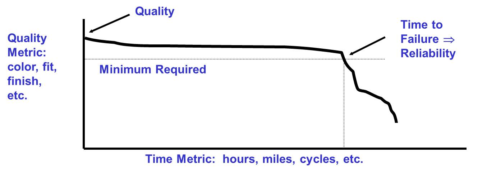
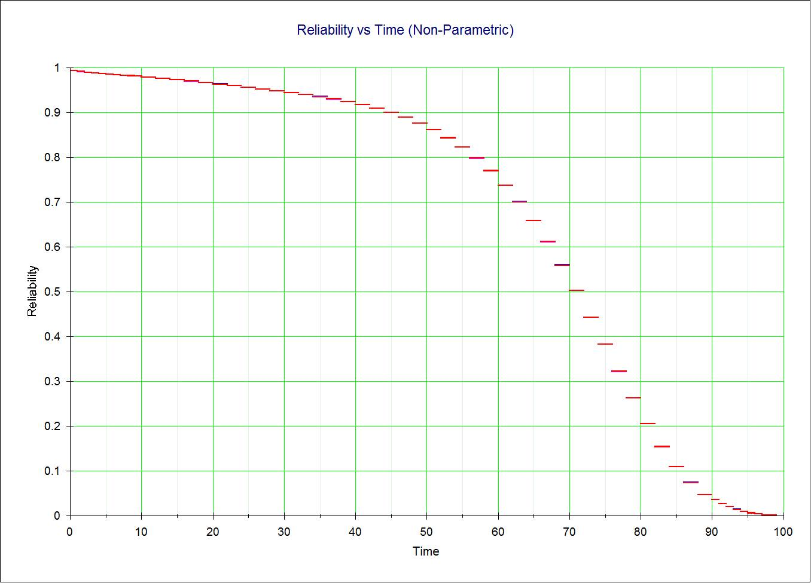

## Terms and Concepts:  Understand basic reliability terms and concepts

This section briefly covers reliability concepts:  what it is, why it's important, and some strategies to improve it.  The word "reliability" often causes confusion.  Part of this confusion comes from different uses of the word.  Here are three common uses:

- Reliability as a Science: Predicting, analyzing, preventing, and mitigating failures - what reliability engineers do

- Reliability as a Concept: Conformance to requirements over time (explained in the following slide)

- Reliability as a Metric: Probability that a system or product will perform in a satisfactory manner for a given period of time when used under specified operation conditions (explained in two slides)

"An effective reliability improvement program involves more than statistics.  A key ingredient is to gain management support to create a reliability improvement program as part of product design and development.  Consider these ideas when presenting a reliability improvement program to your senior management."  [Hahn, Doganaksoy & Meeker, 1999]

## Reliability as a Concept

{width=100%}

In terms of reliability as a concept, think of a 2-dimensional plot with time on the x-axis and quality on the y-axis.  Assuming the level of quality is above the minimum required, as time goes on the system or product will degrade (due to  entropy?).  Eventually the level of quality will fall below the minimum required, i.e., fail.  When that happens, we consider that to be a reliability failure.

Using this construct, quality can be thought of as conformance to requirements at a point of acceptance, i.e., Time = 0; and reliability can be thought of as continuing conformance for a period of time, i.e., Time > 0.

"Reliability, or external quality improvement, is a key element to quality improvement. It is often the part of quality that affects customers the most."  [Hahn, Doganaksoy & Meeker, 1999]

## Reliability as a Metric

{width=100%}

Reliability is the *probability* that a system or product will perform in a *satisfactory manner* for a given period of *time* when used under specified operation *conditions* (customer encountered?).  **This Reliability metric includes both initial quality and durability failures!**

Four key parameters govern reliability:

1. Probability

2. Satisfactory manner and the associated definition of failure (combination of intended function and customer expectations?)

3. Time (specified life?)

4. Specified operating conditions

Our uncertainty of these four key parameters causes even more confusion. And they make reliability difficult to measure.
