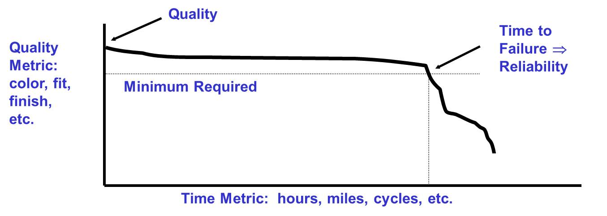
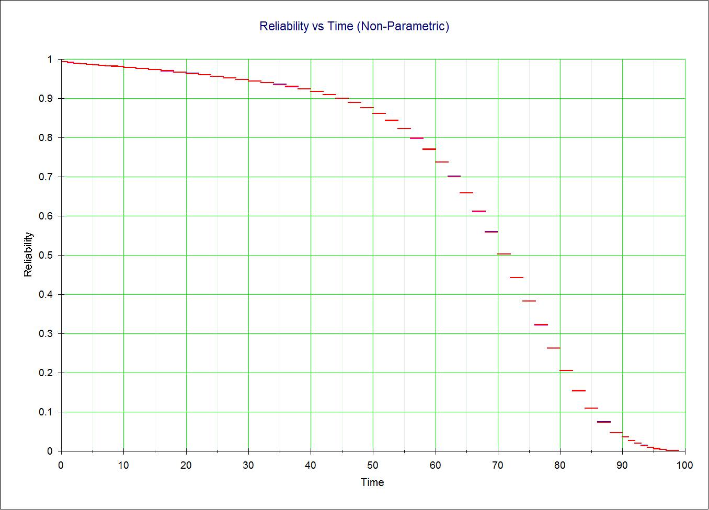

Reliability versus Quality
================
Robert A. Stevens
2021-03-05

## Terms and Concepts: Understand basic reliability terms and concepts

This section briefly covers reliability concepts: what it is, why it’s
important, and some strategies to improve it. The word “reliability”
often causes confusion. Part of this confusion comes from different uses
of the word. Here are three common uses:

  - Reliability as a Science: Predicting, analyzing, preventing, and
    mitigating failures - what reliability engineers do

  - Reliability as a Concept: Conformance to requirements over time
    (explained in the following slide)

  - Reliability as a Metric: Probability that a system or product will
    perform in a satisfactory manner for a given period of time when
    used under specified operation conditions (explained in two slides)

“An effective reliability improvement program involves more than
statistics. A key ingredient is to gain management support to create a
reliability improvement program as part of product design and
development. Consider these ideas when presenting a reliability
improvement program to your senior management.” \[Hahn, Doganaksoy &
Meeker, 1999\]

## Reliability as a Concept

In terms of reliability as a concept, think of a 2-dimensional plot with
time on the x-axis and quality on the y-axis. Assuming the level of
quality is above the minimum required, as time goes on the system or
product will degrade (due to entropy?). Eventually the level of quality
will fall below the minimum required, i.e., fail. When that happens, we
consider that to be a reliability failure.

Using this construct, quality can be thought of as conformance to
requirements at a point of acceptance, i.e., Time = 0; and reliability
can be thought of as continuing conformance for a period of time, i.e.,
Time \> 0.

“Reliability, or external quality improvement, is a key element to
quality improvement. It is often the part of quality that affects
customers the most.” \[Hahn, Doganaksoy & Meeker, 1999\]

## Reliability as a Metric

Reliability is the *probability* that a system or product will perform
in a *satisfactory manner* for a given period of *time* when used under
specified operation *conditions* (customer encountered?). **This
Reliability metric includes both initial quality and durability
failures\!**

Four key parameters govern reliability:

1.  Probability

2.  Satisfactory manner and the associated definition of failure
    (combination of intended function and customer expectations?)

3.  Time (specified life?)

4.  Specified operating conditions

Our uncertainty of these four key parameters causes even more confusion.
And they make reliability difficult to measure.
