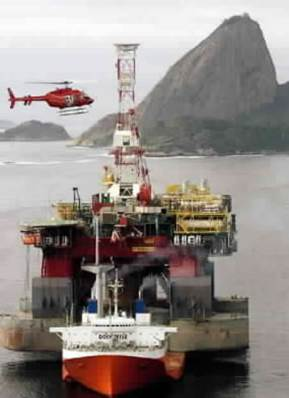

This slideshow is a photo essay of the accidental sinking of an oil rig platform that was being installed off the coast of Brazil for Petrobras.

The following is a Petrobras press release that preceded this multi-million dollar catastrophe.

## Press Release Excerpts

"Petrobras has established new global benchmarks for the generation of exceptional shareholder wealth through an aggressive and innovative programme of cost-cutting on its P36 production facility."

"Conventional constraints have been successfully challenged and replaced with new paradigms appropriate to the globalised corporate marketplace."

"Through an integrated network of facilitated workshops, the project successfully rejected the established constricting and negative influences of prescriptive engineering, onerous quality requirements, and outdated concepts of inspection and client control."

"Elimination of these unnecessary straitjackets has empowered the project's suppliers and contractors to propose highly economical solutions, with the win-win bonus of enhanced profitability margins for themselves."

"The P36 platform shows the shape of things to come in unregulated global market economy of the 21st Century."

{width=100%}

{width=100%}

{width=100%}

{width=100%}

{width=100%}

{width=100%}

{width=100%}

{width=100%}

{width=100%}

{width=100%}

{width=100%}

{width=100%}

{width=100%}

{width=100%}

{width=100%}

{width=100%}

{width=100%}

{width=100%}

## What are the intangible costs of unreliability?

The multi-million dollar lesson learned here is that there is a need for attention to the "systems" approach in program management that includes Reliability and Quality oversight, not just attention to the tangible costs that affect the bottom line.

Makes you think about the risks of  short-cutting reliability engineering, doesn't it?

{width=100%}
