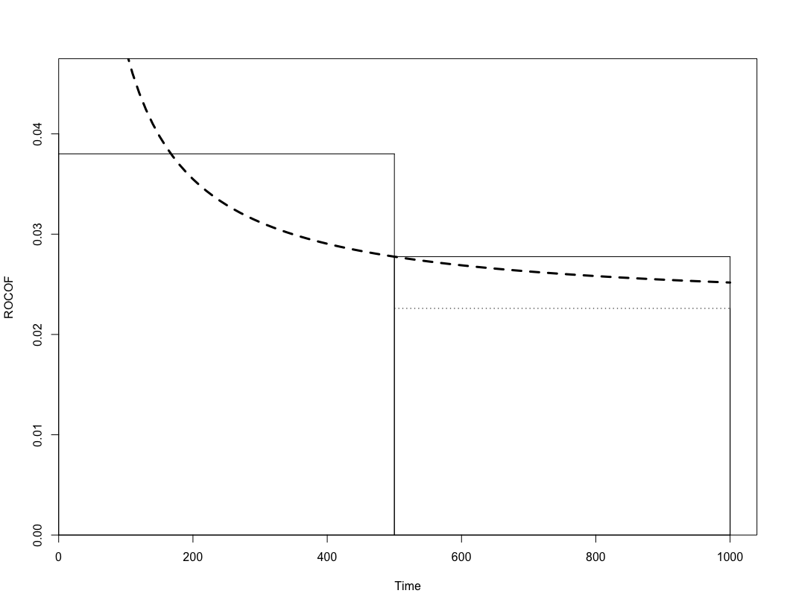
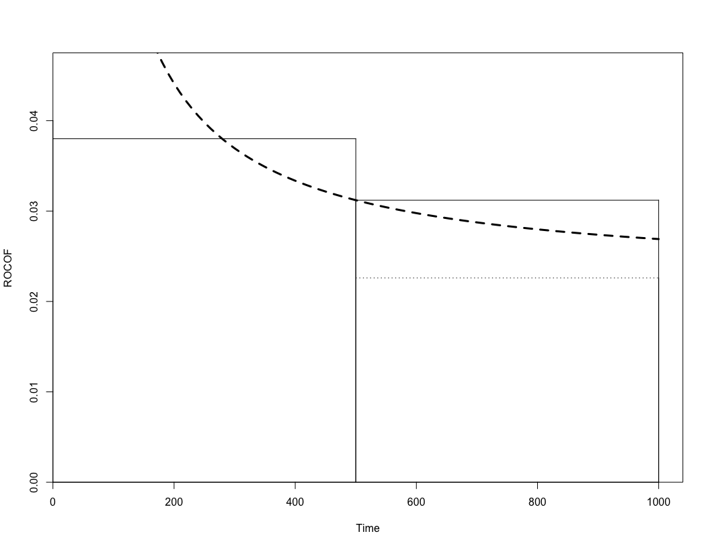
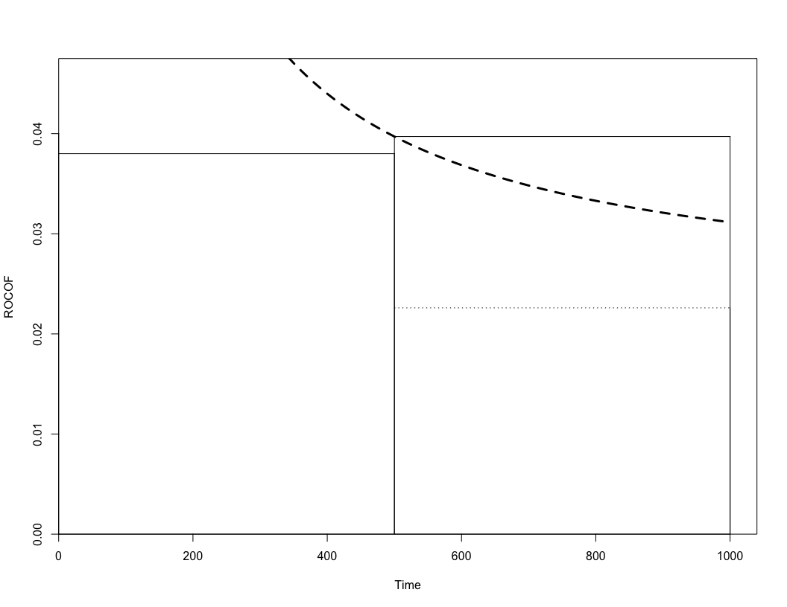
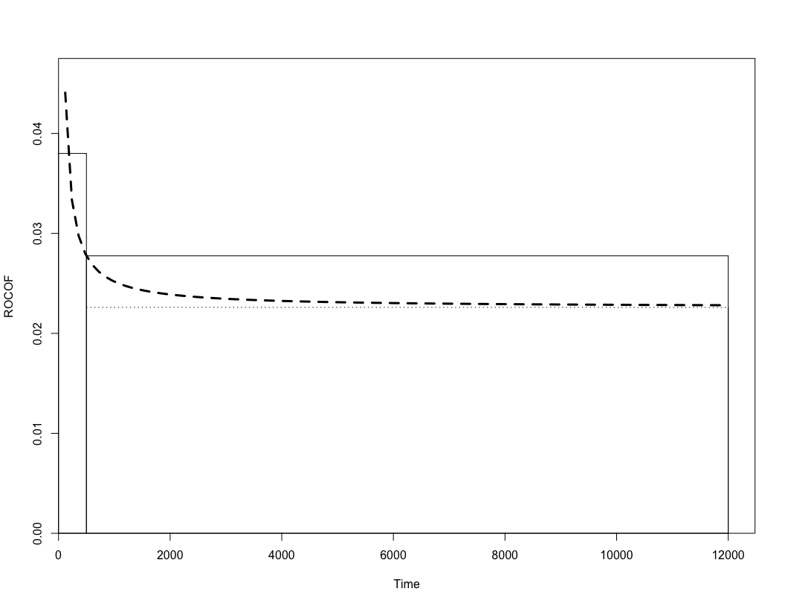
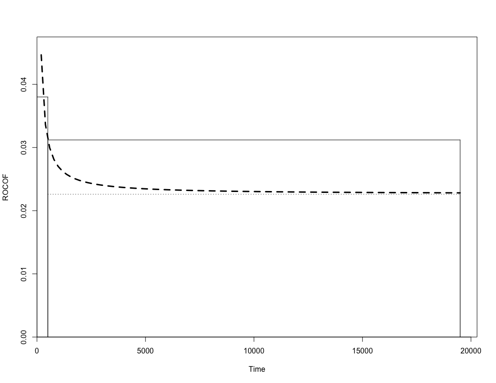
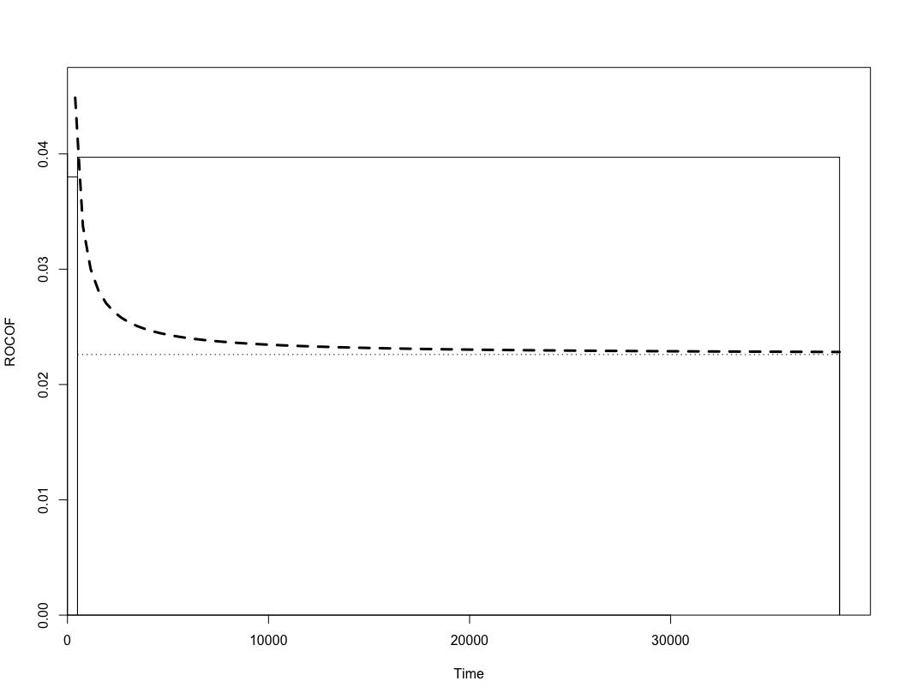

projections
================
Robert A. Stevens
2021-03-05

From “projections.doc” (5/3/2001 10:22 AM)

``` r
plot.proj <- function(t1, t2, current, adj, proj, d, b, m) {
  
  time <- (t2 * c(1:100))/100
  bias <- (d * m * b)/time
  max.y <- 1.25 * current

  plot(
    time, 
    bias + adj, 
    type = "n", 
    xlim = c(0, 1.04 * t2), 
    ylim = c(0, max.y), 
    xaxs = "i", 
    yaxs = "i", 
    xlab = "Time", 
    ylab = "ROCOF"
  )

  lines(time, bias + adj, lty = 2, lwd = 3)
  segments(0, current, t1, current)
  segments(t1, adj, t2, adj, lty = 3)
  segments(t1, proj, t2, proj)
  segments(t1, 0, t1, current)
  segments(t1, 0, t1, proj)
  segments(t2, 0, t2, adj)
  segments(t2, 0, t2, proj)
}
```

``` r
plot.proj(500, 1000, 0.038, 0.0226, 0.027758, 0.7, 0.526, 7)
```

<!-- -->

``` r
plot.proj(500, 1000, 0.038, 0.0226, 0.031200, 0.7, 0.878, 7)
```

<!-- -->

``` r
plot.proj(500, 1000, 0.038, 0.0226, 0.039710, 0.7, 1.746, 7)
```

<!-- -->

``` r
plot.proj.time <- function(adj, d, b, m) {
  time <- (100 * d * m * b)/adj # 1% of adjusted
  time
}
```

``` r
plot.proj.time(0.0226, 0.7, 0.526, 7)
```

    [1] 11404.42

``` r
plot.proj(500, 12000, 0.038, 0.0226, 0.027758, 0.7, 0.526, 7)
```

<!-- -->

``` r
plot.proj.time(0.0226, 0.7, 0.878, 7) 
```

    [1] 19036.28

``` r
plot.proj(500, 19500, 0.038, 0.0226, 0.031200, 0.7, 0.878, 7)
```

<!-- -->

``` r
plot.proj.time(0.0226, 0.7, 1.746, 7)
```

    [1] 37855.75

``` r
plot.proj(500, 38400, 0.038, 0.0226, 0.039710, 0.7, 1.746, 7)
```

<!-- -->
